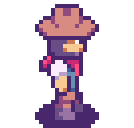
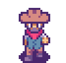
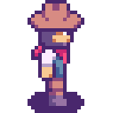
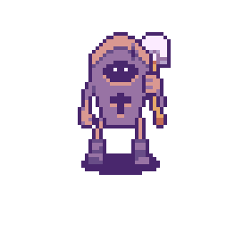
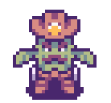
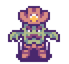

# Cowboy Shooter

Cowboy Shooter is a fun PyGame action game where you battle a variety of monsters! Built with the Pygame library, this project demonstrates object-oriented programming in Python, all packed into an exciting shooting experience.

## How to start the game

If you would rather run directly from the source (or want to develop the game), make sure to have Python installed and run `python -m pip install -r requirements.txt` in the repository folder.

Then you can run python `main.py` or "./main.py" (only for Python 3) in linux operating system to start the game.
If you ever need to remove a module for any reason, use the command `pip uninstall (module-name)`

## Handling `.tsx` File Recognition

If your IDE mistakenly treats `.tsx` files as TypeScript, you may need to manually configure the file association to XML. This can typically be done by editing the IDE's settings to ensure `.tsx` files are recognized as XML to avoid parsing issues during runtime.

## Instructions

- Player can move in 4 directions up, down, left, right and attack.

- The player is provided with limited health and a health bar, when the health bar drops completely the game ends.
- Two types of enemies
  - Coffin: Attacks with shovel on close encounter. Takes 3 bullets to take down.
  
  

  - Cactus: Attacks with bullets from a distance. Takes 1 bullet to take down.

  
- Close the window to exit game.

## Key Controls

|Action|Primary|Secondary|
|:-:|:-:|:-:|
|Move Up|`W`|`up arrow`|
|Move Down|`S`|`down arrow`|
|Move Left|`A`|`left arrow`|
|Move Right|`D`|`right arrow`|
|Attack|`Space`|-|
